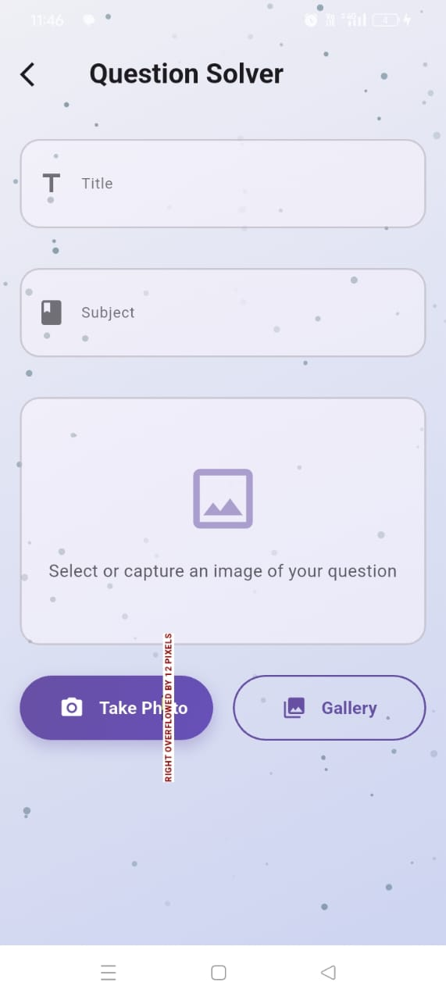
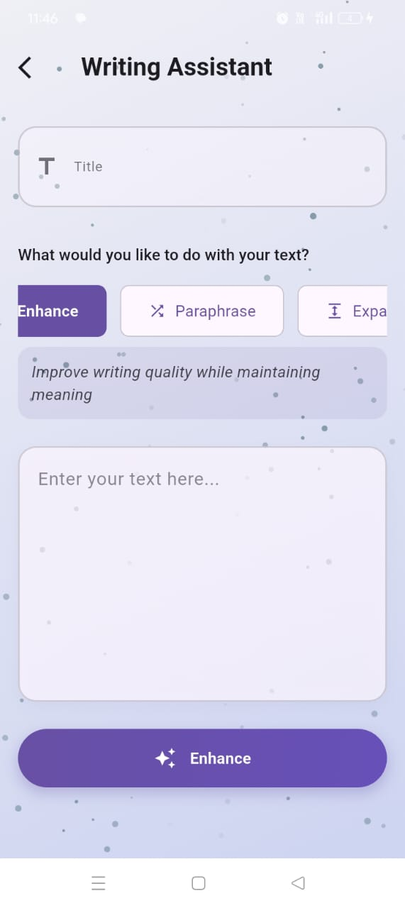
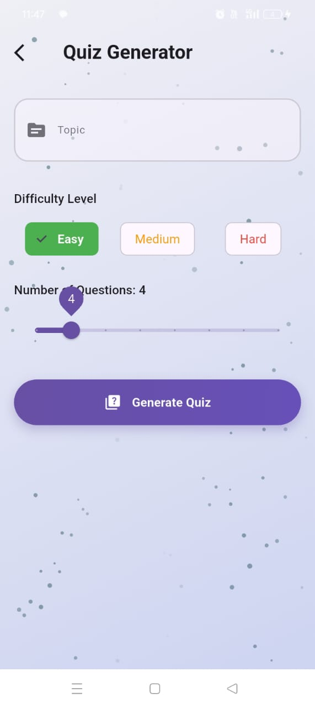
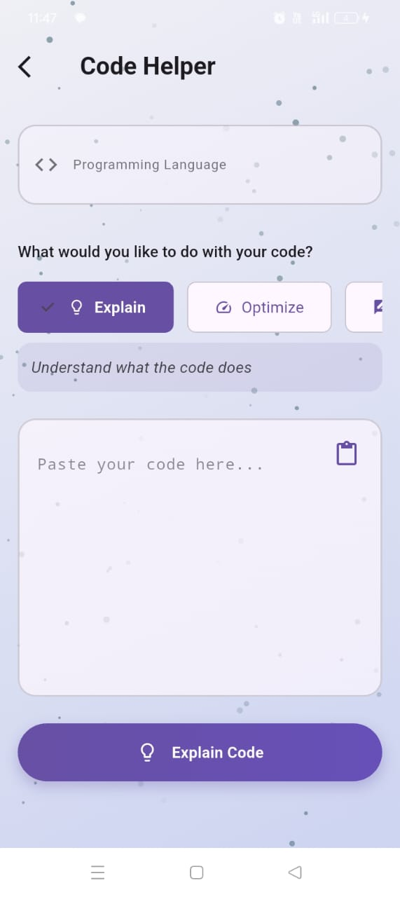
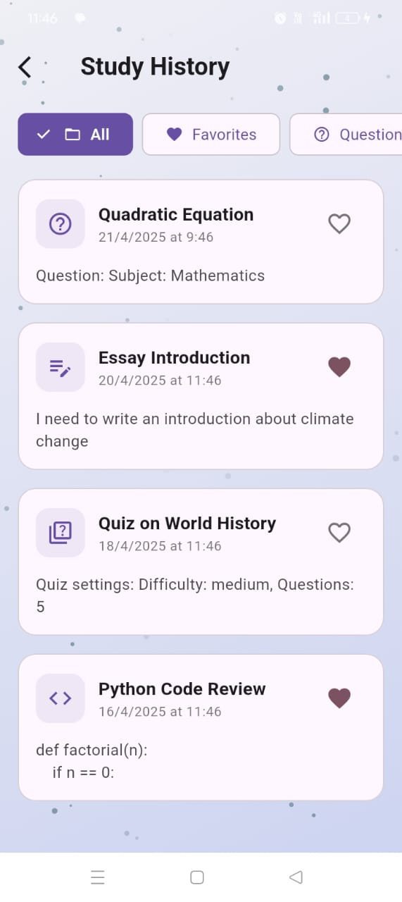

# 📚 StudySmart

**Making studying efficient, interactive, and personalized.**

StudySmart is an AI-powered learning assistant designed to simplify and enhance the student experience. With powerful tools like instant question solving, smart writing suggestions, quiz generation, and code support, it's the ultimate study companion for learners of all levels.

---

## 🚀 Features

### 📷 Question Solver
- Scan and solve handwritten or printed questions.
- Get instant answers across various subjects using AI.

### ✍️ Writing Assistant
- Enhance, paraphrase, or expand essays.
- Refine your content or summarize large documents with ease.

### ❓ Quiz Generator
- Practice with AI-generated quizzes.
- Boost your knowledge on any subject in a fun and interactive way.

### 💻 Code Helper
- Get code reviews, suggestions, and explanations.
- Improve your programming skills with AI support.

---

## 🔧 Tech Stack

- **Frontend**: Flutter
- **AI Integration**: OpenAI 

---
Follow the steps below to set up and run the project locally:

### 1. Clone the Repository

```bash
git clone https://github.com/abhaysaqi/smart_study_app.git
cd smart_study_app
```

### 2. Get Flutter Packages
```bash
flutter pub get
```

### 3. Add Your OpenAI API Key

Open the file where the API key is defined (e.g., lib/services/api_service.dart).
Replace this line:

```bash
const String openAiApiKey = 'OPENAI-API-KEY';
```
With your actual API key:

```bash
const String openAiApiKey = 'sk-your-real-key-here';
```


### 4. Run the App
```bash
flutter run
```

## 🧠 How It Works

1. Choose a feature from the dashboard.
2. Interact with AI by uploading a photo, writing content, or choosing a quiz topic.
3. Get instant feedback, results, or generated content.
4. Save your progress and continue learning at your own pace.

---

## 📱 Screenshots

<div align="center">

  
  
  

  <br/><br/>

  
  
  

</div>

---

## 📩 Feedback & Support

If you have any suggestions, questions, or issues, feel free to reach out!

- Email: [abhaysaqi9@gmail.com]
- GitHub: [github/abhaysaqi]
- Instagram: [https://www.instagram.com/abhay_only27/]

---

## 📜 License

This project is licensed under the MIT License - see the [LICENSE](LICENSE) file for details.

---

**Let AI take your study game to the next level! 🎓💡**
